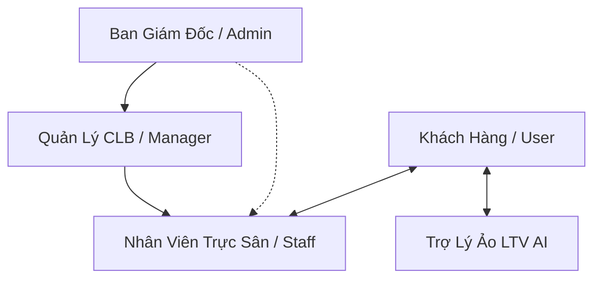

# CHƯƠNG 1: GIỚI THIỆU VỀ DỰ ÁN

## 1. GIỚI THIỆU CHUNG (SỨ MỆNH, TẦM NHÌN, MỤC TIÊU)

### 1.1. Bối cảnh dự án
Trong bối cảnh nền kinh tế số phát triển mạnh mẽ và nhu cầu rèn luyện sức khỏe đang tăng trưởng vượt bậc tại Việt Nam, các câu lạc bộ (CLB) thể thao đối mặt với thách thức lớn trong việc tối ưu hóa hiệu suất vận hành. Hệ thống thể thao LTV (địa chỉ tại **704 Phan Đình Phùng, Phường Quang Trung, TP. Kon Tum**) cũng không nằm ngoài xu thế đó. Phương pháp đặt sân truyền thống qua điện thoại, tin nhắn mạng xã hội hay ghi chép sổ tay bộc lộ nhiều điểm hạn chế như: dễ nhầm lẫn lịch đặt, trùng sân, khó quản lý doanh thu thời gian thực, quản lý ca trực nhân viên thủ công phức tạp và thiếu tính tương tác trực tiếp 24/7 với khách hàng.

Để giải quyết triệt để các vấn đề này, dự án **"Hệ thống Quản lý Sân LTV"** đã được nghiên cứu và phát triển. Đây là một hệ thống ứng dụng web hai phân hệ chuyên sâu (Client - Admin) hoạt động trên nền tảng MERN stack (MongoDB, ExpressJS, ReactJS, NodeJS) nhằm tự động hóa quy trình đặt lịch, quản trị tài chính, nhân sự và nâng cao trải nghiệm thể thao số hóa.

### 1.2. Sứ mệnh (Mission)
Sứ mệnh của dự án **LTV Badminton** là **"Kết nối thể thao - Nâng tầm trải nghiệm bằng công nghệ"**. Hệ thống hướng tới việc xóa bỏ mọi rào cản địa lý và quy trình thủ công phức tạp trong đặt sân thể thao, giúp khách hàng tiếp cận dịch vụ đặt sân chuyên nghiệp chỉ bằng vài lượt chạm trên mọi thiết bị di động. Đồng thời, hệ thống cung cấp cho nhà quản trị một công cụ quản lý số hóa toàn diện, nâng cao năng suất vận hành và tối đa hóa hiệu suất sử dụng cơ sở vật chất.

### 1.3. Tầm nhìn (Vision)
Tầm nhìn đến năm 2030, **LTV** định hướng trở thành giải pháp công nghệ quản trị sân thể thao đa năng hàng đầu khu vực miền Trung - Tây Nguyên. Hệ thống có khả năng mở rộng sang nhiều bộ môn thể thao khác nhau, tiên phong tích hợp trí tuệ nhân tạo (AI Assistant) nhằm tạo nên một hệ sinh thái thể thao số thông minh, cá nhân hóa trải nghiệm khách hàng tối đa và thúc đẩy phong trào thể dục thể thao cộng đồng phát triển bền vững.

### 1.4. Mục tiêu chiến lược (Objectives)
Dự án được triển khai nhằm đạt được các mục tiêu cốt lõi sau:
*   **Về phía Khách hàng (User Experience):**
    *   Cung cấp giao diện trực quan hiển thị chính xác trạng thái sân trống theo thời gian thực (Real-time Booking Calendar) hoạt động liên tục 24/7.
    *   Rút ngắn thời gian đặt sân xuống dưới 3 phút với quy trình xác thực đơn hàng nhanh chóng và phương thức thanh toán linh hoạt.
    *   Tích hợp Trợ lý ảo AI thông minh hỗ trợ giải đáp mọi thắc mắc ngay lập tức về điều khoản đặt lịch, tư vấn kỹ thuật, và thông tin CLB.
*   **Về phía Ban quản lý (Operational Efficiency):**
    *   Quản trị tập trung toàn bộ dữ liệu sân bãi, trạng thái hoạt động (Trống, Đang sử dụng, Bảo trì).
    *   Giảm thiểu 95% sai sót trùng lịch nhờ cơ chế khóa giờ đặt sân tự động trong cơ sở dữ liệu khi có đơn hàng chờ duyệt.
    *   Số hóa toàn diện công tác nhân sự thông qua chức năng phân ca trực (Shift) và quản lý lương (Salary) cho nhân viên trực sân.
    *   Báo cáo thống kê trực quan (Data Analytics) về doanh thu thực tế và hiệu suất khai thác sân (Court Performance) theo biểu đồ trực quan, giúp đưa ra quyết định kinh doanh chính xác.
*   **Về mặt Công nghệ (Technical Standards):**
    *   Xây dựng hệ thống an toàn, bảo mật dữ liệu khách hàng bằng phương pháp mã hóa mật khẩu, phân quyền JWT (JSON Web Tokens).
    *   Ứng dụng thiết kế responsive mượt mà tương thích cao trên cả điện thoại di động và máy tính cá nhân.
    *   Tích hợp API tiên tiến (Google Gemini API) nhằm đem lại trải nghiệm AI đàm thoại tự nhiên và cá nhân hóa.

---

## 2. CƠ CẤU TỔ CHỨC CỦA HỆ THỐNG / DỰ ÁN

Hệ thống quản lý LTV Badminton được thiết kế dựa trên mô hình phân quyền chức năng nghiêm ngặt nhằm phản ánh chính xác mô hình vận hành nhân sự ngoài đời thực của một CLB thể thao chuyên nghiệp. Cơ cấu tổ chức và sơ đồ phân quyền trong mã nguồn hệ thống được thể hiện qua các vai trò sau:

### 2.1. Ban Giám đốc / Quản trị viên cấp cao (Admin)
Đây là vai trò có quyền hạn cao nhất trong toàn bộ hệ thống (định nghĩa trong Schema `User` với `role: "admin"`). 
*   **Trách nhiệm chính:** 
    *   Giám sát hoạt động kinh doanh toàn diện của câu lạc bộ.
    *   Quản lý tài khoản và phân quyền cho cấp dưới (Manager, Staff).
    *   Xem báo cáo phân tích doanh thu cao cấp (Revenue Analytics) và hiệu suất hoạt động của từng sân riêng biệt để định hướng chiến lược.
    *   Thực hiện các quyền can thiệp đặc biệt như khóa tài khoản vi phạm, khôi phục mật khẩu, và chỉnh sửa cấu hình hệ thống cốt lõi.

### 2.2. Quản lý Câu lạc bộ (Manager)
Đóng vai trò điều hành trực tiếp mọi hoạt động hàng ngày tại CLB (định nghĩa trong Schema `User` với `role: "manager"`).
*   **Trách nhiệm chính:**
    *   Quản lý danh sách sân bãi, cập nhật đơn giá, hình ảnh sân.
    *   Thực hiện phân ca làm việc (`shift`) và ghi nhận mức lương (`salary`) cho đội ngũ nhân viên trực sân.
    *   Theo dõi và giám sát chất lượng dịch vụ thông qua đánh giá và phản hồi của khách hàng (Review & Feedback).
    *   Hỗ trợ giải quyết các khiếu nại hoặc tranh chấp về lịch đặt sân.

### 2.3. Nhân viên Trực sân (Staff)
Là lực lượng trực tiếp đón tiếp khách hàng tại sân và thực hiện các thao tác vận hành nhanh (định nghĩa trong Schema `User` với `role: "staff"`).
*   **Trách nhiệm chính:**
    *   Xem lịch trình sân hàng ngày qua giao diện trực quan (`ScheduleViewer`) để sắp xếp chỗ ngồi và chuẩn bị sân cho khách.
    *   Kiểm duyệt nhanh các yêu cầu đặt sân (Approve/Reject) và xác thực hình ảnh chuyển khoản cọc (Payment Evidence Verification) của khách hàng.
    *   Hỗ trợ khách hàng đặt sân trực tiếp và ghi nhận thanh toán bằng tiền mặt ("tại sân").
    *   Cập nhật trạng thái sân thời gian thực khi có sự cố phát sinh (ví dụ: chuyển trạng thái sân sang "Đang bảo trì" do rách lưới, hỏng mặt thảm).

### 2.4. Khách hàng / Hội viên (User / Customer)
Là đối tượng thụ hưởng dịch vụ đặt sân trực tuyến của LTV Badminton (định nghĩa trong Schema `User` với `role: "user"`).
*   **Quyền hạn & Tính năng:**
    *   Đăng ký, đăng nhập tài khoản cá nhân, bảo mật và đổi mật khẩu chủ động.
    *   Tra cứu thông tin sân trống, khung giờ trống một cách trực quan qua Calendar.
    *   Tạo yêu cầu đặt sân trực tuyến, tùy chọn thời gian, thời lượng và ghi chú.
    *   Thực hiện thanh toán cọc và tải lên minh chứng giao dịch ngân hàng để nhân viên đối soát.
    *   Xem lịch sử đặt sân, theo dõi trạng thái phê duyệt đơn và nhận thông báo tức thời.
    *   Tương tác tự do với Trợ lý ảo AI của hệ thống.

---

## 3. MÔ TẢ SẢN PHẨM / DỊCH VỤ

Dự án LTV Badminton cung cấp một giải pháp dịch vụ khép kín từ đời thực lên không gian số, bao gồm dịch vụ cho thuê cơ sở vật chất sân bãi và hệ thống phần mềm quản lý thông minh.

### 3.1. Dịch vụ cốt lõi tại sân (Offline Services)
*   **Dịch vụ cho thuê sân thể thao theo giờ:** Cung cấp hệ thống sân tiêu chuẩn, ánh sáng chống lóa mắt, phục vụ từ 05:00 đến 22:00 hàng ngày.
*   **Dịch vụ đặt sân định kỳ:** Hỗ trợ các cơ quan, đoàn thể hoặc các nhóm lông thủ đặt sân cố định theo tuần/tháng với mức giá ưu đãi và giữ sân cố định.
*   **Dịch vụ bổ trợ chuyên nghiệp:** Cung cấp dịch vụ cho thuê vợt, bán cầu lông, các loại nước giải khát, đồ ăn nhẹ và các dịch vụ căng vợt lấy ngay tại quầy.

### 3.2. Mô tả các phân hệ chức năng phần mềm (Digital Product Modules)
Mã nguồn hệ thống được cấu trúc rõ ràng thành 3 phân hệ chính: Backend API, Frontend Client (Khách hàng) và Frontend Admin (Quản trị viên). Các chức năng chính được cài đặt bao gồm:

#### A. Phân hệ Khách hàng (LTV Badminton Client Web App)
1.  **Giao diện đặt sân trực tuyến trực quan (Smart Court Calendar):**
    *   Tích hợp bộ xem lịch `CourtCalendar` và `ScheduleViewer` giúp hiển thị toàn bộ các sân hiện có dưới dạng lưới thời gian trực quan. Khách hàng dễ dàng biết sân nào đang trống vào khung giờ nào để click đặt nhanh.
2.  **Đặt sân nhanh & Chống trùng lịch (Booking System):**
    *   Khi khách hàng tiến hành đặt sân, API backend sẽ kiểm tra trạng thái trùng giờ (`Booking.findOne({ courtId, date, hour, status: { $ne: "rejected" } })`). Nếu khung giờ đó đã có người gửi yêu cầu và đang chờ duyệt hoặc đã duyệt, hệ thống sẽ ngăn chặn ngay lập tức để tránh tranh chấp sân.
3.  **Hệ thống Thanh toán linh hoạt & Upload hóa đơn:**
    *   Hỗ trợ 4 hình thức thanh toán: *Thanh toán tại sân*, *Chuyển khoản cọc*, *Cash* và *Transfer*.
    *   Cho phép khách hàng chụp và tải lên hình ảnh biên lai chuyển khoản ngân hàng (`paymentImage`). Biên lai này được lưu trữ và hiển thị trực tiếp cho Ban quản lý để làm minh chứng phê duyệt, bảo đảm quy trình tài chính minh bạch.
4.  **Trợ lý ảo AI thông minh (LTV AI Assistant - Gemini API):**
    *   Đây là tính năng đột phá của hệ thống. Trợ lý ảo AI sử dụng API trí tuệ nhân tạo thế hệ mới của Google (Gemini) được huấn luyện để hiểu sâu sắc về dịch vụ của LTV Badminton. 
    *   AI có thể tư vấn giá sân, giờ mở cửa, cách thức thanh toán cọc, hướng dẫn và giải đáp các câu hỏi tự do của người dùng với tốc độ phản hồi cực nhanh và văn phong thân thiện.
5.  **Hộp thư liên hệ & Đánh giá (Review & Contact Page):**
    *   Hỗ trợ khách hàng gửi phản ánh dịch vụ trực tiếp thông qua form `ContactPage`, tự động đẩy dữ liệu về backend xử lý. Khách hàng còn có thể để lại số sao đánh giá (`avgRating`, `reviewCount`) trực tiếp trên từng sân.

#### B. Phân hệ Quản trị (LTV Badminton Admin Modern Dashboard)
1.  **Dashboard thống kê thời gian thực (Modern Analytics Dashboard):**
    *   Phân tích dữ liệu doanh thu tự động thông qua biểu đồ trực quan `RevenueAnalytics`.
    *   Đo lường hiệu suất khai thác sân thông qua module `CourtPerformance`, chỉ ra sân nào đem lại doanh thu cao nhất và được đặt nhiều nhất.
2.  **Quản lý phê duyệt Đơn đặt sân chuyên sâu (AdminBookingRequests & AdminPaymentManagement):**
    *   Giao diện quản lý danh sách yêu cầu đặt sân dạng lưới hiện đại với các bộ lọc trạng thái (Chờ duyệt, Đã duyệt, Bị từ chối).
    *   Tích hợp tính năng xem ảnh chụp biên lai giao dịch ngân hàng phóng to (modal preview) giúp đối soát tiền cọc cực kỳ nhanh chóng.
    *   Hỗ trợ tính năng từ chối đơn hàng kèm lý do chi tiết (`rejectReason`).
3.  **Hệ thống thông báo thông minh (Notification Service):**
    *   Ngay khi nhân viên duyệt (`approved`) hoặc từ chối (`rejected`) đơn hàng của khách, hệ thống backend sẽ tự động tạo một thực thể `Notification` trong cơ sở dữ liệu và gửi thông báo trực tiếp đến trang cá nhân của khách hàng tương ứng để họ nắm bắt thông tin kịp thời.
4.  **Quản lý Sân bãi (Court Management):**
    *   Thêm mới, cập nhật mô tả, đơn giá thuê theo giờ, hình ảnh và trạng thái hoạt động thực tế của sân ("Trống", "Đang sử dụng", "Đang bảo trì").
5.  **Quản lý Nhân viên & Ca làm việc (Staff & Payroll Management):**
    *   Chức năng quản lý nhân viên chuyên sâu `AdminStaffManagement` cho phép Admin kiểm soát thông tin nhân viên, chỉ định ca trực (`shift`) cụ thể và nhập mức lương (`salary`). Đây là công cụ hữu hiệu để tinh gọn bộ máy vận hành CLB LTV Badminton.
